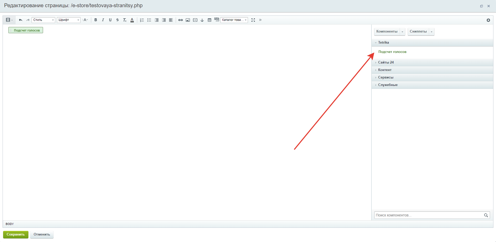
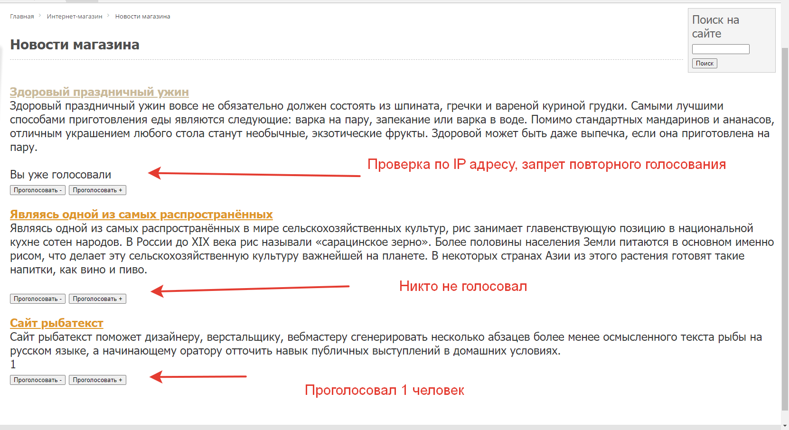

# Component Counting votes for 1C Bitrix
Компонент голосование за новость, с защитой от накрутки голосования  

При первом запуске создаётся таблица    
В таблицу записываются IP адреса голосующих  
С одного и того же IP адреса нельзя проголосовать дважды или более того раз  

Установка:    
Поместить папку tetrika в каталог local\components    
Обновить компоненты в публичной части сайта    

Выбрать компонент из раздела tetrika    
    

Внешний вид компонента   
    